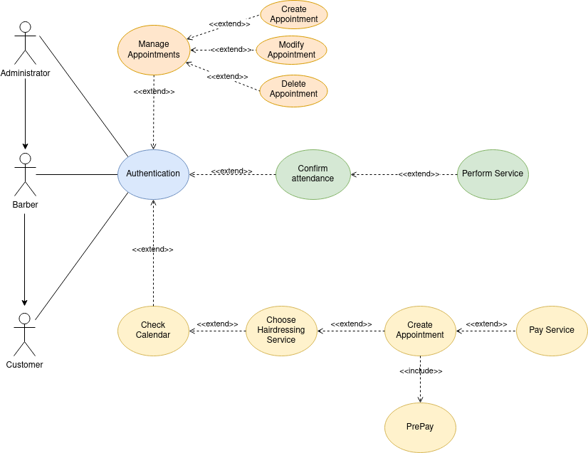

## Use Cases Specifications

  

 

A barbershop wants to offer its customers the possibility to choose a date/time to come in for a haircut as well as to choose the person who will perform the service. This need arises from the fact that the barber has to answer the phone in the middle of a cut, which normally lasts 30 minutes, to make new appointments and this means a large investment of time for the barber.

- Customers will be able to create an account and set up personal details in their profile. They will also be able to consult the salon's calendar, choose the desired service, create an appointment with the desired date and time, as well as choose the barber who will provide the service.
- Customers will be able to confirm the creation of the appointment after making a pre-payment of €5, which will be deducted from the total price of the chosen service. With this measure the Barber will secure a part of the payment in case the Client does not make use of the previously created appointment.
- After receiving the service, the client will pay the rest of the cost of the service by direct payment in the barber's shop or through the application.
- In the system there is an Administrator role that can manage the appointments, being possible to create, edit and delete them. These possibilities can also be performed by the Barber who at any given time can have the role of Administrator.

  

## Use Cases Specification:

## Índice

-   [Introduction](#introduction)
-   [Description](#description)
-   [Specification of actors](#actors-specifications)
-   [Use Cases Specification](#use-case-specification)

### Introduction

This document specifies the **use case diagram** of the **Barber Shop Schedule & Management** application.

This document outlines the use cases identified, as well as the actors involved in them.

### Description

The objective is to create a system to manage appointments in a Barber Shop.

### Actors specifications

This document specifies the different actors involved in the proposed solution.

#### Barber

| Barber         | Barber                        |
| --------------- | ---------------------------- |
| Description     | The Barber consults the appointment calendar to check the next service to be performed                                     |
| Characteristics | The Barber must be authenticated in the system |
| Relations       |                              |
| References      |                              |
| Notes           |                              |
| Author          | _Carlos Oliva_               |
| Date            | _29/03/2023_                 |

#### Administrator

| Administrator   | Administrator                |
| --------------- | ---------------------------- |
| Description     | Administrator of the system, you can do CRUD        |
| Characteristics | Can create, modify, consult, delete appointments    |
| Relations       |                              |
| References      |                              |
| Notes           |                              |
| Author          | _Carlos Oliva_               |
| Date            | _29/03/2023_                 |

#### Client

| Client          | Client                       |
| --------------- | ---------------------------- |
| Description     | Client of the system, can search in the calendar, choose a service, create an appointment and pre-pay for it and finally pay for the service in full.                                 |
| Characteristics | Can create, modify, consult, delete appointments   |
| Relations       |                              |
| References      |                              |
| Notes           |                              |
| Author          | _Carlos Oliva_               |
| Date            | _29/03/2023_                 |

### Use Case Specification

#### Manage appointments

|  Use Case   CU.1 |  Manage appointments        |
| ---------------- | --------------------------- |
| Sources          | The use case is based on [this document](https://github.com/colidom/proyecto-ets/issues/4).                          |
| Actor            | Administrator               |
| Description      | Administrator can manage appointments |
| Basic flow       | The administrator is authenticated and can manage appointments.  |
| Pre-conditions   | Be authenticated            |
| Post-conditions  |                             |
| Requirements     |                             |
| Notes            |                             |
| Author           | _Carlos Oliva_              |
| Date             | _20/01/23_                  |

#### Confirm attendance

| Use Case   CU.2  |  Confirm attendance         |
| ---------------- | --------------------------- |
| Sources          | The use case is based on [this document](https://github.com/colidom/proyecto-ets/issues/4).                          |
| Actor            | Barber                      |
| Description      | After consulting the calendar, the Barber can confirm the Client's appointment before starting the service contracted by the Client.           |
| Basic flow       |                             |
| Pre-conditions   | Be authenticated and consult calendar                  |
| Post-conditions  | Perform service             |
| Requirements     |                             |
| Notes            |                             |
| Author           | _Carlos Oliva_              |
| Date             | _20/01/23_                  |

#### Performs Service

| Use Case   CU.3  |  Performs Service           |
| ---------------- | --------------------------- |
| Sources          | The use case is based on [this document](https://github.com/colidom/proyecto-ets/issues/4).                          |
| Actor            | Barber                      |
| Description      | After confirming the appointment the Barber can start the service.  |
| Basic flow       |                             |
| Pre-conditions   | Be authenticated and confirm appointment |
| Post-conditions  |                             |
| Requirements     |                             |
| Notes            |                             |
| Author           | _Carlos Oliva_              |
| Date             | _20/01/23_                  |

#### Consult calendar

|  Use Case   CU.4 |  Consult calendar     |
| ---------------- | ------------------------- |
| Sources          | The use case is based on [this document](https://github.com/colidom/proyecto-ets/issues/4).     |
| Actor            | Client and Barber         |
| Description      | Check calendar for availability        |
| Basic flow       |                           |
| Pre-conditions   | Be authenticated          |
| Post-conditions  |                           |
| Requirements     |                           |
| Notes            |                           |
| Author           | _Carlos Oliva_            |
| Date             | _20/01/23_                |

#### Choose Hairdressing Service

|  Use Case   CU.5 |  Choose Hairdressing Service    |
| ---------------- | -------------------------       |
| Sources          | The use case is based on [this document](https://github.com/colidom/proyecto-ets/issues/4).                              |
| Actor            | Client                          |
| Description      | Choose the service you want to receive           |
| Basic flow       |                                 |
| Pre-conditions   | Consult calendar and check availability          |
| Post-conditions  |                                 |
| Requirements     |                                 |
| Notes            |                                 |
| Author           | _Carlos Oliva_                  |
| Date             | _20/01/23_                      |

#### Create an appointment

|  Use Case   CU.6 |  Create an appointment          |
| ---------------- | -------------------------       |
| Sources          | The use case is based on [this document](https://github.com/colidom/proyecto-ets/issues/4).                              |
| Actor            | Client                          |
| Description      | Create an appointment for the service you wish to receive    |
| Basic flow       |                                 |
| Pre-conditions   | To have chosen a service        |
| Post-conditions  | Make prepayment to create reservation                        |
| Requirements     |                                 |
| Notes            |                                 |
| Author           | _Carlos Oliva_                  |
| Date             | _20/01/23_                      |

#### PrePayment

|  Use Case   CU.7 |  PrePayment                     |
| ---------------- | -------------------------       |
| Sources          | The use case is based on [this document](https://github.com/colidom/proyecto-ets/issues/4).                              |
| Actor            | Client                          |
| Description      | To make an appointment you have to make a prepayment of 5€.    |
| Basic flow       |                                 |
| Pre-conditions   | Have created an appointment     |
| Post-conditions  |                                 |
| Requirements     |                                 |
| Notes            |                                 |
| Author           | _Carlos Oliva_                  |
| Date             | _20/01/23_                      |

#### Payment Service
|  Use Case   CU.8 |  Payment Service                |
| ---------------- | -------------------------       |
| Sources          | The use case is based on [this document](https://github.com/colidom/proyecto-ets/issues/4).                              |
| Actor            | Client                          |
| Description      | At the end of the service, you can pay the full amount of the service, minus the €5 prepayment.                             |
| Basic flow       |                                 |
| Pre-conditions   | Have created an appointment     |
| Post-conditions  |                                 |
| Requirements     |                                 |
| Notes            |                                 |
| Author           | _Carlos Oliva_                  |
| Date             | _20/01/23_                      |

