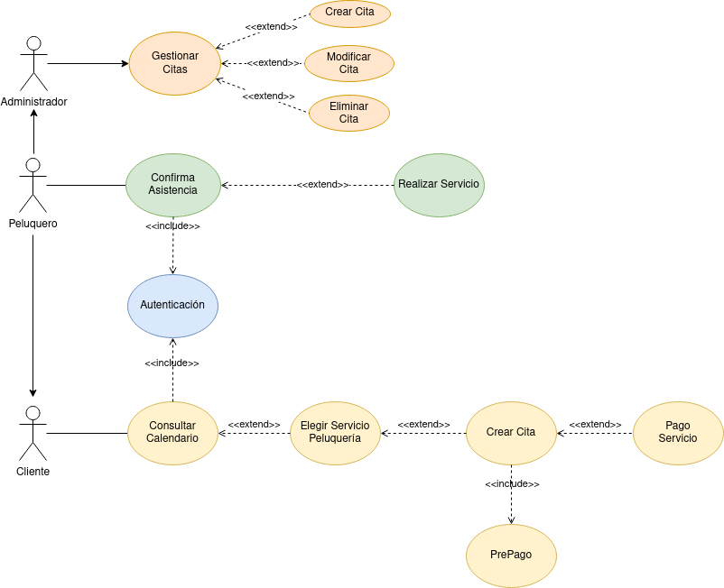

## Especificaciones Casos de Uso

  

 

Una barbería quiere brindar la posibilidad a sus clientes elegir una fecha/hora para asistir a cortarse el pelo además de elegir la persona que le hará el servicio. Esta necesidad surge producto de que el barbero tiene que atender el teléfono en mitad de un corte que normalmente dura 30 minutos, para apuntar las nuevas citas y esto supone una grán inversión de tiempo por parte del mismo.

- Los clientes tendrán la posibilidad de crear una cuenta y en su perfil configurar datos personales. Podrán además consultar el calendario de la peluquería, elegir el servicio deseado, crear una cita con la fecha y hora deseada, además de elegir el barbero que le proporcionará dicho servicio.
- Los clientes podrán confirmar la creación de la cita tras hacer un pago previo de 5€, que serán restados del precio total del servicio elegido. Con esta medida el Barbero se asegurará una parte del pago en caso de que el Cliente no haga uso de la cita creada con anterioridad.
- Tras recibir el servicio, el cliente, se dispondrá a pagar el resto del costo del servicio mediante pago directo en la barbería o mediante la aplicación.
- En el sistema existe un rol de Administrador que podrá gestionar las citas, siendo posible crear, editar y eliminarlas. Estas posibilidades pueden ser desempeñadas también por el Barbero que en un momento dado puede tener el rol de Administrador.

  

## Especificación de Casos de Uso:

## Índice

-   [Introducción](#introducción).
-   [Descripción](#descripción).
-   [Especificación de actores](#especificación-de-actores).
-   [Especificación de casos de uso](#especificación-de-casos-de-uso-1).

### Introducción

El presente documento especifica el **diagrama de casos de uso** de la aplicación **Barber Shop Schedule & Management**.

Este documento trata a grandes rasgos, los casos de uso identificados, así como los actores que intervienen en ellos.

### Descripción

El objetivo es realizar un sistema para gestionar las citas de una Barbería.

### Especificación de Actores

En el presente documento se realiza la especificación de los diferentes actores que intervienen en la solución propuesta.

#### Barbero

| Barbero         | Barbero                      |
| --------------- | ---------------------------- |
| Descripción     | El Barbero consulta el calendario de citas para comprobar el siguiente servicio a realizar                 |
| Características |  El Barbero se debe autenticar en el sistema |
| Relaciones      |                              |
| Referencias     |                              |
| Notas           |                              |
| Autor           | _Carlos Oliva_               |
| Fecha           | _29/03/2023_                 |

#### Administrador

| Administrador   | Administrador                |
| --------------- | ---------------------------- |
| Descripción     | Administrador del sistema, puede hacer CRUD  |
| Características | Puede crear,  modificar, consultar, eliminar citas                                            |
| Rlaciones       |                              |
| Referencias     |                              |
| Notas           |                              |
| Autor           | _Carlos Oliva_               |
| Fecha           | _29/03/2023_                 |

#### Cliente

| Cliente         | Cliente                      |
| --------------- | ---------------------------- |
| Descripción     | Cliente del sistema, puede buscar en el calendario, elegir un servicio, crear cita y hacer prepago de la misma y finalmente pagar la totalidad del servicio                           |
| Características | Puede crear, modificar, consultar, eliminar citas                                            |
| Rlaciones       |                              |
| Referencias     |                              |
| Notas           |                              |
| Autor           | _Carlos Oliva_               |
| Fecha           | _29/03/2023_                 |

### Especificación de Casos de uso

#### Gestionar citas

| Caso de Uso CU.1 |  Gestionar citas |
| ---------------- | --------------------------- |
| Fuentes          | El caso de uso se sustenta en [este documento](https://github.com/colidom/proyecto-ets/issues/4).       |
| Actor            | Administrador               |
| Descripción      | Administrador puede gestionar citas  |
| Flujo básico     | Administrador se autentica y puede gestionar citas                                            |
| Pre-condiciones  | Estar autenticado           |
| Post-condiciones |                             |
| Requerimientos   |                             |
| Notas            |                             |
| Autor            | _Carlos Oliva_              |
| Fecha            | _20/01/23_                  |

#### Confirma Asistencia

|Caso de Uso CU.2  |  Confirma Asistencia        |
| ---------------- | --------------------------- |
| Fuentes          | El caso de uso se sustenta en [este documento](https://github.com/colidom/proyecto-ets/issues/4).       |
| Actor            | Barbero                     |
| Descripción      | Tras consultar calendario el Barbero puede confirmar la cita del cliente antes de iniciar el servicio contratado por el mismo |
| Flujo básico     |                             |
| Pre-condiciones  | Estar autenticado y consultar calendario         |
| Post-condiciones | Confirmar cita              |
| Requerimientos   |                             |
| Notas            |                             |
| Autor            | _Carlos Oliva_              |
| Fecha            | _20/01/23_                  |

#### Realiza Servicio

|Caso de Uso CU.3  |  Realiza Servicio           |
| ---------------- | --------------------------- |
| Fuentes          | El caso de uso se sustenta en [este documento](https://github.com/colidom/proyecto-ets/issues/4).       |
| Actor            | Barbero                     |
| Descripción      | Tras confirmar la cita el Barbero puede iniciar el servicio           |
| Flujo básico     |                             |
| Pre-condiciones  | Estar autenticado y confirmar la cita |
| Post-condiciones |                             |
| Requerimientos   |                             |
| Notas            |                             |
| Autor            | _Carlos Oliva_              |
| Fecha            | _20/01/23_                  |

#### Consultar calendario

| Caso de Uso CU.4 |  Consultar calendario     |
| ---------------- | ------------------------- |
| Fuentes          | El caso de uso se sustenta en [este documento](https://github.com/colidom/proyecto-ets/issues/4).     |
| Actor            | Cliente y Barbero         |
| Descripción      | Consultar el calendario para comprobar disponibilidad   |
| Flujo básico     |                           |
| Pre-condiciones  | Estar autenticado         |
| Post-condiciones |                           |
| Requerimientos   |                           |
| Notas            |                           |
| Autor            | _Carlos Oliva_            |
| Fecha            | _20/01/23_                |

#### Elegir Servicio Peluquería

| Caso de Uso CU.5 |  Elegir Servicio Peluquería     |
| ---------------- | -------------------------       |
| Fuentes          | El caso de uso se sustenta en [este documento](https://github.com/colidom/proyecto-ets/issues/4).           |
| Actor            | Cliente                         |
| Descripción      | Elige servicio que quiere recibir            |
| Flujo básico     |                                 |
| Pre-condiciones  | Consultar calendario y ver disponibilidad    |
| Post-condiciones |                                 |
| Requerimientos   |                                 |
| Notas            |                                 |
| Autor            | _Carlos Oliva_                  |
| Fecha            | _20/01/23_                      |

#### Crear cita

| Caso de Uso CU.6 |  Crear cita                     |
| ---------------- | -------------------------       |
| Fuentes          | El caso de uso se sustenta en [este documento](https://github.com/colidom/proyecto-ets/issues/4).           |
| Actor            | Cliente                         |
| Descripción      | Crea una cita para el servicio que desea recibir  |
| Flujo básico     |                                 |
| Pre-condiciones  | Haber elegido un servicio       |
| Post-condiciones | Realizar prepago para crear reserva               |
| Requerimientos   |                                 |
| Notas            |                                 |
| Autor            | _Carlos Oliva_                  |
| Fecha            | _20/01/23_                      |

#### PrePago

| Caso de Uso CU.7 |  PrePago                        |
| ---------------- | -------------------------       |
| Fuentes          | El caso de uso se sustenta en [este documento](https://github.com/colidom/proyecto-ets/issues/4).           |
| Actor            | Cliente                         |
| Descripción      | Para crer una cita ha de hacer un prepago de 5€   |
| Flujo básico     |                                 |
| Pre-condiciones  | Haber creado una cita           |
| Post-condiciones |                                 |
| Requerimientos   |                                 |
| Notas            |                                 |
| Autor            | _Carlos Oliva_                  |
| Fecha            | _20/01/23_                      |

#### Pago Servicio
| Caso de Uso CU.8 |  Pago Servicio                  |
| ---------------- | -------------------------       |
| Fuentes          | El caso de uso se sustenta en [este documento](https://github.com/colidom/proyecto-ets/issues/4).           |
| Actor            | Cliente                         |
| Descripción      | Tras finalizar el servicio, puede pagar el total del servicio, descontando los 5€ del prepago             |
| Flujo básico     |                                 |
| Pre-condiciones  | Haber creado una cita           |
| Post-condiciones |                                 |
| Requerimientos   |                                 |
| Notas            |                                 |
| Autor            | _Carlos Oliva_                  |
| Fecha            | _20/01/23_                      |

